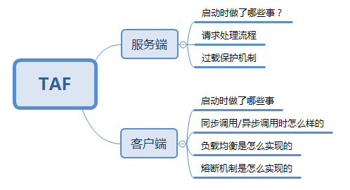
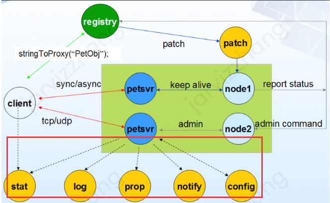

## TAF Java部分源码学习一



## Server启动流程

-  程序入口：

  ```java
  package com.qq.tars.server.startup;
  import com.qq.tars.server.core.Server;
  
  public class Main {
      public static void main(String[] args) {
          new Server().startUp(args);
      }
  }
  ```

  ```java
  public Server() {
      // 加载配置文件
      loadServerConfig();
  }
  
  public void startUp(String args[]) {
      try {
          // Config logger compenent
          configTafLogger();
  
          //stdout, stderr redirect
          ServerLogger.init();
  
          // init and start taf om service
          startOmService();
  
          // Start Container
          startAppContainer();
  
          // Start NIO Server
          startNIOServer();
  
          // Start SessionManager
          startSessionManager();
  
          // Register server hook
          registerServerHook();
  
          System.out.println("[SERVER] server is ready...");
      } catch (Throwable ex) {
          System.out.println("[SERVER] failed to start server...");
          System.out.close();
          System.err.close();
          System.exit(-1);
      }
  }
  ```

- 1. 加载服务配置

     - 加载过程主要由 ConfigurationManager  （单例--饿汉模式，类加载时就实例化）完成，调用 init() -> loadServerConfig() -> new ServerConfig().load(...)

     - ServerConfig 类 ：全局服务配置，记录了服务的基本信息

       ```java
       private String application;  //应用名
       private String serverName; //服务名
       private Endpoint local;
       private String node; 
       private String basePath; //基本路径
       private String config; //配置中心地址
       private String notify; //通知中心地址
       private String log;  //日志中心地址
       private String logPath; //日志文件路径
       private String logLevel; //滚动log日志级别
       private int logRate;
       private String dataPath; 
       private String localIP;
       private int localPort;
       
       private int sessionTimeOut;
       private int sessionCheckInterval;
       private boolean tcpNoDelay;
       private int udpBufferSize;
       
       private String charsetName;
       private LinkedHashMap<String, ServantAdapterConfig> servantAdapterConfMap;
       private CommunicatorConfig communicatorConfig;
       
       public ServerConfig load(Config conf) {
           application = conf.get("/tars/application/server<app>", "UNKNOWN");
           serverName = conf.get("/tars/application/server<server>", null);
           //...
       }
       ```

     - Config 类， 读取配置文件内容。（ “<、</、  >、  />、  #、 =”）

  2. 初始化日志组件

  3. 将标准输出/错误输出重定向到stdout.log/stderr.log文件

     ```java
     public static void init() {
         System.setOut(new PrintStream(new LoggingOutputStream(Logger.getLogger(STDOUT_log_NAME)), true));
         System.setErr(new PrintStream(new LoggingOutputStream(Logger.getLogger(STDERR_LOG_NAME)), true));
     }
     ```

  4. 初始化并启动运营服务监控

     

     - OmServiceMngr :: initAndStartOmService

     ```java
     //远程拉取业务服务的配置文件
     ConfigHelper.getInstance().setConfigInfo(communicator, app, serverName, basePath);  
     //收集业务的心跳上报，服务版本号
     NodeHelper.getInstance().setNodeInfo(communicator, app, serverName, container);
     //  收集服务状态变更、异常信息以及业务自定义的异常信息等重要信息，然后对这些信息进行监控告警，比如上报连接数据库失败的信息
     NotifyHelper.getInstance().setNotifyInfo(communicator, app, serverName);
     
     PropertyReportHelper.getInstance().setPropertyInfo(communicator, modualName);
     // reportVersion
     NodeHelper.getInstance().reportVersion(ServerVersion.getVersion());
     // 创建等待队列属性: 平均值、最大值
     Policy avgPolicy = new CommonPropPolicy.Avg();
     Policy maxPolicy = new CommonPropPolicy.Max();
     PropertyReportHelper.getInstance().createPropertyReporter(OmConstants.PropWaitTime, avgPolicy, maxPolicy);
     
     // JVM heap使用监控
     PropertyReportHelper.getInstance().createPropertyReporter(OmConstants.PropHeapUsed, new MemoryHeapUsedAvg());
     PropertyReportHelper.getInstance().createPropertyReporter(OmConstants.PropHeapCommitted, new MemoryHeapCommittedAvg());
     PropertyReportHelper.getInstance().createPropertyReporter(OmConstants.PropHeapMax, new MemoryHeapMaxAvg());
     
     // JVM线程数量监控
     PropertyReportHelper.getInstance().createPropertyReporter(OmConstants.PropThreadCount, new ThreadNumAvg());
     
     // JVM GC监控
     for (GarbageCollectorMXBean gcMXBean : ManagementFactory.getGarbageCollectorMXBeans())
     {
         PropertyReportHelper.getInstance().createPropertyReporter(OmConstants.PropGcCount + gcMXBean.getName(), new GCNumCount(gcMXBean.getName()));
         PropertyReportHelper.getInstance().createPropertyReporter(OmConstants.PropGcTime + gcMXBean.getName(), new GCTimeSum(gcMXBean.getName()));
     }
     
     // 初始化服务stat监控上报 
     // 对业务Server之间调用的流量、平均耗时、异常率、超时率进行统计监控
     ServerStatHelper.getInstance().init(communicator);
     ServerAuthHelper.getInstance().init(communicator);
     // 拉起各个Service的任务线程
     ScheduledServiceMngr.getInstance().start();
     ```

  5. 初始化容器

     经过前面的一系列初始化工作，当前环境已经具备了配置信息、日志记录、运营服务了，此时就应该将业务代码和资源加载进来了，TAF采用了容器Container的概念来实现这一功能，容器初始化所需的配置信息在service.xml 文件读取。 

     大致可以分为5个过程：

     - new一个类加载器AppClassLoader并设为当前线程上下文类加载器，加载BasePath/ROOT目录下的资源文件
     - 读取BasePath/WEB-INF/service.xml文件，解析后加载listener和service，并设置service最大负载max-load，线程池大小threads，队列大小等，生成的ServiceHomeSkeleton放入skeletonMap<serviceName,ServiceHomeSkeleton>中，遍历AppContextListener，触发serviceStarted监听事件
     - 加载om管理命令servant （om admin servant）
     - 初始化service ，遍历skeletonMap，调用AnalystManager的registry方法，将每个业务service[servant]的方法注册入map中（http_cache / context_cache）
     - 启动appContext，遍历appContextListener，触发appContextStarted监听事件

     ```java
     // Server.java
     protected void startAppContainer() throws Exception {
         this.mainProtocolFactory = new JceServiceProtocolFactory(new JceCodec(ConfigurationManager.getInstance().getserverConfig().getCharsetName()));
         this.processor = new ServerProcessor();
         this.container = new AppContainer();
         ContainerManager.registerContainer(this.container);
     
         this.threadPool = new ServerThreadPoolDispatcher();
         this.mainSelectorManager = new SelectorManager(Utils.getSelectorPoolSize(), mainProtocolFactory, threadPool,processor, keepAlive, "server-tcp-reactor", false);
          this.mainSelectorManager.setTcpNoDelay(ConfigurationManager.getInstance().getserverConfig().isTcpNoDelay());
     
         this.container.start();
     }
     ```

     ```java
     // Container.java 接口  --> AppContainer.java 类
     public void start() throws Exception {
         loadApps();  //加载
         defaultApp = contexts.get("");
         System.out.println("[SERVER] The container started successfully.");
     }
     
     public void loadApps() throws Exception {
         //从ServerConfig 的BasePath/apps目录下加载配置文件
         String root = ConfigurationManager.getInstance().getserverConfig().getBasePath();
         File dirs = new File(root + "/apps");
         final ClassLoaderManager protocolManager = ClassLoaderManager.getInstance();
         dirs.listFiles(new FileFilter() {
             public boolean accept(File path) {
                 String name = path.getName();
                 if (name.equals("ROOT")) {
                     name = "";
                 }
                 if (path.isDirectory()) {
                     // here 实际调用new AppContextImpl(name, path)
                     AppContext context = new AppContext(name, path);
                     
                     contexts.put(name, context);
                     protocolManager.registerClassLoader(name, context.getAppContextClassLoader());
                 }
                 return false;
             }
         });
     }
     ```

     ```java
     /* AppContextImpl.java  [core code] */
     public AppContextImpl(String name, File path) {
         ClassLoader oldClassLoader = null;
         try {
             this.name = name;
             this.path = path;
             oldClassLoader = Thread.currentThread().getContextClassLoader();
             //1.新建一个新的类加载器 AppClassLoader， 设置为当前线程上下文类加载器
             this.classLoader = new AppClassLoader(name, findURLClassPath());
             Thread.currentThread().setContextClassLoader(this.classLoader);
             //2.获取WEB-INF/service.xml并解析，加载解析后的listener和service
             initFromServiceConfigFile();
             //3.注入 om admin servant [tafnode和业务交互使用的管理命令servant比较特殊，不需要带app、service]
             injectOmServices();
             //4.遍历skeletonMap，初始化service
             initServices();
             //5.appContext启动，遍历appContextListener触发监听事件
             appContextStarted(); 
             System.out.println("[SERVER] The application started successfully.  {appname=" + name + "}");
         } catch (Exception ex) {
             ready = false;
             ex.printStackTrace();
             System.out.println("[SERVER] failed to start the applicaton. {appname=" + this.name + "}");
         } finally {
             if (oldClassLoader != null) Thread.currentThread().setContextClassLoader(oldClassLoader);
         }
     }
     
     //2.获取WEB-INF/service.xml并解析，加载解析后的listener和service
     protected void initFromServiceConfigFile() throws Exception {
         // 1. 使用类加载器加载services.xml配置文件
         URL url = this.classLoader.getResource("WEB-INF/services.xml");
         if (url == null) {
             System.out.println("WARN\tfailed to find WEB-INF/services.xml, " + "tas service will be disabled:contextName=[" + name + "]");
             return;
         }
         //解析service.xml
         XMLConfigFile cfg = new XMLConfigFile();
         cfg.parse(new FileInputStream(new File(url.toURI())));
     
         XMLConfigElement root = cfg.getRootElement();//获取根节点
         ArrayList<XMLConfigElement> elements = root.getChildList(); //子节点列表
         // 2. load context init params.
         loadInitParams(root.getChildListByName("context-param"));
         // 3. Load context listeners  加载监听器
         loadAppContextListeners(elements);
         // 4. Load services 根据子节点生成ServiceHomeSkeleton，put进skeletonMap<name,skeleton> 中
         loadAppServices(elements);
     }
     
     //4.遍历skeletonMap，初始化service
     private void initServices() {
         for (String skeletonName : skeletonMap.keySet()) {
             ServiceHomeSkeleton skeleton = skeletonMap.get(skeletonName);
             Class<?> api = skeleton.getApiClass();
             try { //here
                 AnalystManager.getInstance().registry(name(), api, skeleton.name());
             } catch (Exception e) {
                 System.err.println("app[" + name + "] init jce service[" + api.getName() + "] failed");
                 e.printStackTrace();
             }
         }
     }
     
     //将service的方法注册到不同协议对应的concurrentHashMap中，以便调用的时候路由
     public void registry(String contextName, Class<?> api, String objName) {
         //判断类是否有@HttpService
         if (api.isAnnotationPresent(HttpService.class)) {
             Method[] methods = api.getDeclaredMethods();
             Map<String, Method> nameMethod = new HashMap<String, Method>();
             for (Method m : methods) {
                 nameMethod.put(m.getName(), m);
             }
             http_cache.put(objName, nameMethod);
         } else {
             Map<Method, JceMethodInfo> jceMethodsMap = JceHelper.getJceMethodInfo(api, objName);
             if (jceMethodsMap != null && !jceMethodsMap.isEmpty()) {
                 Map<String, JceMethodInfo> methodMap = new HashMap<String, JceMethodInfo>();
                 for (Entry<Method, JceMethodInfo> entry : jceMethodsMap.entrySet()) {
                     methodMap.put(entry.getKey().getName(), entry.getValue());
                 }
                 context_cache.putIfAbsent(objName, methodMap);
             }
         }
     }
     ```

    6. 启动 NIO Server， 初始化网络IO线程模型。 （使用Reactor模式）

     ```java
     protected void startNIOServer() throws IOException {
         // 1. Start main port server, and it is required.
         startMainServer(host, port);
         // 2. Start admin port and it is required.
         startMainServer(adminHost, adminPort);
         
         // 3. Start extended UDP server, and it is optional.
         startUDPServer();
         // 4. Start extended TCP server, and it is optional.
         startTCPServer();
     }
     ```

       - 第一个MainServer就是监听处理走JCE协议的客户端请求，JCE下面的传输层是TCP可靠的传输，第二个绑定在adminHost上的MainServer用于处理和Node节点交互的管理命令。
    
       - 另外两个则用于支持HTTP协议的请求，包括TCP和UDP两种协议，在实现上只需要绑定对应的编解码器Codec就可以了，后文重点关注JCE协议。
       - 还有一个值得注意的地方，目前去理解当前这样的实现，发现多个Obj都会对同一个监听端口复用，也就是说在服务接收到请求的时候是没有办法直接区分开是那个Obj的请求的，只有在后面的业务线程处理时才会分发到各个服务Obj上处理。这里也就是为什么之后看到TAF对于服务连接数的管理，目前是按整个服务的总量来做的。

    7. 启动Session管理器

        管理器实现类为SessionManagerImpl，它可提供Session的注册和回收，同时还可以绑定监听器来实现一些功能逻辑，目前主要了解其完成的两个工作：

        - 管理Session，定期回收过期SessionTimeout连接
        - 注册监听器记录连接数，当连接总数大于整个服务的总量限制maxConns关闭该创建的连接

    8.  Register server hook

        当服务退出时候的资源释放，这部分功能可以通过注册JVM 的 Runtime shutdownHook加以实现，主要是关闭seletor管理器和app容器 。

        ```java
        private void registerServerHook() {
            Runtime.getRuntime().addShutdownHook(run() -> {
        
                try {
                    // 1. Stop SelectorManager
                    if (mainSelectorManager != null) {
                        mainSelectorManager.stop();
                    }
                    if (udpSelectorManager != null) {
                        udpSelectorManager.stop();
                    }
        
                    System.out.println("[SERVER] server stopped successfully.");
        
                    // 2. Stop Container
                    if (container != null) {
                        container.stop();
                    }
                } catch (Exception ex) {
                    System.err.println("The exception occured at stopping server...");
                }
        
            });
        }
        ```

        
