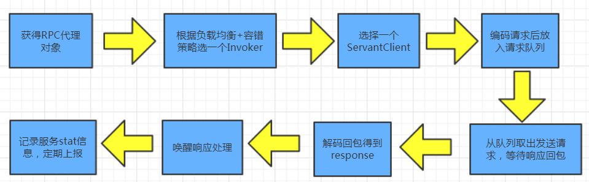

# TAF Java部分源码学习三

## Client调用服务过程

### 一、生成RPC代理对象

#### 客户端远程调用方式

```java
// 1. 获取通信器配置
CommunicatorConfig config = ConfigurationManager.getInstance().getserverConfig().getCommunicatorConfig();
// 2. 初始化通信器
Communicator communicator = CommunicatorFactory.getInstance().getCommunicator(config);
// 被调用的服务名
String servantName = "FangZhou.TafTestSvr.HelloObj";
// 3. 生成客户端代理
HelloPrx proxy = communicator.stringToProxy(HelloPrx.class, servantName);
// 4. 进行远程调用，并获取结果
String resultStr = proxy.sayHello();
```

从上述客户端调用方式代码可以看出，通信器Communicator使用了工厂模式+单例模式，看一下CommunicatorFactory的getCommunicator方法，它先从缓存中根据配置config获取Communicator，如果不存在则new一个，并放入缓存map中

```java
private volatile ConcurrentHashMap<Object, Communicator> communicatorMap = new ConcurrentHashMap<Object, Communicator>();
// ... 
public Communicator getCommunicator(CommunicatorConfig config) {
    Communicator communicator = communicatorMap.get(config);
    if (communicator != null) {
        return communicator;
    }
    communicatorMap.putIfAbsent(config, new Communicator(config));
    return communicatorMap.get(config);
}
```

#### 1.初始化通信器Communicator

看看new Communicator(config) 中的  initCommunicator(config) 初始化通信器方法，主要以下3个过程

  * 初始化ClientLogger,对应日志文件 taf_client.log
  * 为communicator生成一个唯一标识ID
  * 获取客户端线程池，先从clientThreadPoolMap中获取，没有则创建并放入缓存，线程池的相关属性由communicatorConfig配置文件设置

> 这里抛出一个问题，此处的线程池的作用是什么呢？ 后面进行分析

```java
private void initCommunicator(CommunicatorConfig config) throws ConfigException {
    if (inited.get()) {
        return;
    }
    lock.lock();
    try {
        if (!inited.get()) {
            try {
                // 初始化ClientLogger,对应日志文件 taf_client.log
                ClientLogger.init(config.getLogPath(), config.getLogLevel());
                // 为communicator生成一个唯一标识ID
                if (StringUtils.isEmpty(config.getLocator())) {
                    this.id = UUID.randomUUID().toString().replaceAll("-", "");
                } else {
                    this.id = UUID.nameUUIDFromBytes(config.getLocator().getBytes()).toString().replaceAll("-", "");
                }
                this.communicatorConfig = config;
                // 获取客户端线程池  getClientThreadPoolExecutor
                this.threadPoolExecutor = ClientPoolManager.getClientThreadPoolExecutor(config);
                inited.set(true);
            } catch (Throwable e) {
                inited.set(false);
                throw new ConfigException(e);
            }
        }
    } finally {
        lock.unlock();
    }
}
```

#### 2. 获取代理对象

Communicator初始化完成后，调用stringToProxy方法获取服务代理对象，调用了ServantProxyFactory的getServantProxy方法，先从代理缓存中根据被调服务名（servantName）获取服务代理，若不存在，则使用双层检查加锁方式（double-check）生成单例代理对象并放入缓存中，即**每个servant只会有一个代理对象**。

```java
public <T> Object getServantProxy(Class<T> clazz, String objName, ServantProxyConfig servantProxyConfig,
                                  LoadBalance<T> loadBalance, ProtocolInvoker<T> protocolInvoker) {
    Object proxy = cache.get(objName);
    //double-check
    if (proxy == null) {
        lock.lock();
        try {
            proxy = cache.get(objName);
            if (proxy == null) {
                // 获取代理
                ObjectProxy<T> objectProxy = communicator.getObjectProxyFactory().getObjectProxy(clazz, objName, servantProxyConfig, loadBalance, protocolInvoker);
                // createProxy(clazz, objectProxy) 利用jdk动态代理生成RPC代理对象，并放入缓存
                cache.putIfAbsent(objName, createProxy(clazz, objectProxy));
                proxy = cache.get(objName);
            }
        } finally {
            lock.unlock();
        }
    }
    return proxy;
}
```

> 那么，代理对象是如何生成的呢？

首先，一个代理对象需要代理对象的类型class、远程服务名servantName、服务代理配置servantProxyConfig、负载均衡策略loadBalance、协议解析器 protocolInvoker，

因此，逻辑就很明了了，这里主要有3点：服务代理配置（基本信息、服务节点）、负载均衡策略、协议解析器 

值得注意的是，服务代理配置`ServantProxyConfig`中有一项为是否直连`directConnection `的配置项，默认为false，即非直连。

- 直连：客户端直接通过 IP：Port 向服务节点发起连接请求，不通过主控来连接
- 非直连：客户端会定期通过主控查询刷新并拉取到该服务的所有部署上线的服务节点的路由地址信息，同时将路由信息保存到本地，之后如果从主控拉取失败则会直接从本地读取。

> 如果通过直连的方式进行连接，不仅增加了繁琐的配置工作，且假设这些配置的服务节点都宕机那么服务也就不可用了，但是通过主控可以实现服务路由地址的定期查询和更新，客户端无需事先知道实际的路由地址，也就是说这个过程对客户端开发是透明的，因此一般使用非直连的方式。 

```java
public <T> ObjectProxy<T> getObjectProxy(Class<T> api, String objName, ServantProxyConfig servantProxyConfig,LoadBalance<T> loadBalance, ProtocolInvoker<T> protocolInvoker)
    throws ProxyException {
    // 1.获取服务代理配置，配置信息从communicatorConfig中获取，例如异步超时时间、是否set分组、模块名...
    if (servantProxyConfig == null) {
        servantProxyConfig = createServantProxyConfig(objName);
    } else {
        servantProxyConfig.setCommunicatorId(communicator.getId());
        servantProxyConfig.setLocator(communicator.getCommunicatorConfig().getLocator());
    }
    // 设置代理调用的服务节点，先尝试从主控拉取server node， 获取不到再尝试在本地缓存中拉取
    /**  主要代码如下：
    endpoints = communicator.getQueryHelper().getServerNodes(cfg);  //从主控获取 or
    endpoints = ServantCacheManager.getInstance().get(communicator.getId(),  cfg.getSimpleObjectName(), communicatorConfig.getDataPath());  //主控获取失败则从本地缓存中获取
    servantProxyConfig.setObjectName(endpoints);  //设置服务节点
    **/
    updateServantEndpoints(servantProxyConfig); 

    if (loadBalance == null) {
        //如果没有设置负载均衡策略则创建默认策略--轮询 roundRobinLoadBalance
        loadBalance = createLoadBalance(servantProxyConfig);
    }

    // 根据servant接口的协议注解[@JceService/@HttpService]创建对应协议解析器
    if (protocolInvoker == null) {
        protocolInvoker = createProtocolInvoker(api, objName, servantProxyConfig);
    }
    return new ObjectProxy<T>(api, objName, servantProxyConfig, loadBalance, protocolInvoker, communicator);
}
```

#### 3. 初始化负载均衡策略

TAF默认的负载均衡策略是轮询roundRobin，若客户端调用时在请求上下文中（JceContext对应的map）有设置对应的hash参数则优先使用相应的hash策略，策略选用的优先级为： 一致性hash > hash > roundRobin。 

#### 4. 初始化invoker---RPC调用者，由ServantProtocolInvoker负责构造

```java
public JceProtocolInvoker(Class<T> api, ServantProxyConfig config, ProtocolFactory protocolFactory, ThreadPoolExecutor threadPoolExecutor) {
    super(api, config, protocolFactory, threadPoolExecutor);
    /** 预热分析api注解结构 */
    // 通过java反射机制获取servant.class的所有接口方法信息（参数、返回值等）存放在cache中
    AnalystManager.getInstance().registry(api, servantProxyConfig.getSimpleObjectName());
}
```

ServantProtocolInvoker （RPC协议，负责构造invoker）的实例构造器里调用了initInvoker方法，其子类有JceProtocolInvoker和HttpProtocolInvoker

```java
protected void initInvoker() {
    try {
        ClientLogger.getLogger().info("try to init invoker|conf=" + servantProxyConfig.toString());
        // 从服务节点中解析出URL集合， 此处URL是RPC服务的一个抽象，包括protocol、host、port、param等
        List<URL> list = ParseTools.parse(servantProxyConfig);
        for (URL url : list) {
            try {
                boolean active = url.getParameter(Constants.TAF_CLIENT_ACTIVE, false);
                if (active) {
                    ClientLogger.getLogger().info("try to init invoker|active=" + active + "|" + url.toIdentityString());
                    //invoker在此处创建， 创建后存入allInvoker（ConcurrentHashSet）中，
                    // 一个远程服务对应一个invoker，一个invoker对应一个SelectorManager
                    allInvoker.add(create(api, url));
                } else {
                    ClientLogger.getLogger().info("inactive invoker can`t to init|active=" + active + "|" + url.toIdentityString());
                }
            } catch (Throwable e) {
                ClientLogger.getLogger().error("error occurred on init invoker|" + url.toIdentityString(), e);
            }
        }
    } catch (Throwable t) {
        ClientLogger.getLogger().error("error occurred on init invoker|" + servantProxyConfig.getObjectName(), t);
    }
}
```

- 从服务节点从服务节点中解析出URL（RPC服务抽象）集合，多个节点之间由`:`分割开，所以先根据：获取多个节点，然后在根据空格解析每个节点的属性，最后构建对应的URL对象

  ```java
  FangZhou.TafTestSvr.HelloObj@tcp -h 10.100.7.81 -p 10028 -a 1 -t 60000:tcp -h 10.198.131.34 -p 17890 -a 1 -t 60000:tcp -h 10.198.131.22 -p 17890 -a 1 -t 60000
   // -a 1表示active, -a 0表示nactive -s setDisivision,
  ```

- 如果active==1， 构建invoker并存入allInvoker中。一个远程服务对应一个invoker，一个invoker对应一个URL。 （allInvoker是ServantProtocolInvoker维护的该Servant可用的服务节点列表 ）

- 以 JceProtocolInvoker为例， 上述代码中` allInvoker.add(create(api, url)); `创建 JceInvoker对象的时候会调用getClients(url)，一个invoker默认会创建4个ServantClient，每个ServantClient对应一个socket连接（默认tcp）。

  ```java
  @Override
  public Invoker<T> create(Class<T> api, URL url) throws Exception {
      return new JceInvoker<T>(servantProxyConfig, api, url, getClients(url));
  }
  
  protected ServantClient[] getClients(URL url) throws IOException {
      // 默认开启4个连接，一个ServantClient对应一个socket连接 --> Constants.default_connections = 4
      int connections = url.getParameter(Constants.TAF_CLIENT_CONNECTIONS, Constants.default_connections);
      ServantClient[] clients = new ServantClient[connections];
      for (int i = 0; i < clients.length; i++) {
          // 初始化ServantClient
          clients[i] = initClient(url);
      }
      return clients;
  }
  
  protected ServantClient initClient(URL url) {
      ServantClient client = null;
      try {
          // 是否开启tcpNoDelay
          boolean tcpNoDelay = url.getParameter(Constants.TAF_CLIENT_TCPNODELAY, false);
          long connectTimeout = url.getParameter(Constants.TAF_CLIENT_CONNECTTIMEOUT, Constants.default_connect_timeout); //连接超时时间
          long syncTimeout = url.getParameter(Constants.TAF_CLIENT_SYNCTIMEOUT, Constants.default_sync_timeout); //同步调用超时时间
          long asyncTimeout = url.getParameter(Constants.TAF_CLIENT_ASYNCTIMEOUT, Constants.default_async_timeout); //异步调用超时时间
          // 默认是TCP连接，udpMode=false
          boolean udpMode = url.getParameter(Constants.TAF_CLIENT_UDPMODE, false);
          int enableAuth = url.getParameter(Constants.TAF_CLIENT_ENABLEAUTH, 0);
  
          //此处的threadPoolExecutor就是初始化通信器Communicator的时候创建的线程池
          if (this.selectorManager == null) {
              this.selectorManager = ClientPoolManager.getSelectorManager(this.protocolFactory, this.threadPoolExecutor, true, udpMode, this.servantProxyConfig);
          }
  
          client = new ServantClient(url.getHost(), url.getPort(), this.selectorManager, udpMode);
          client.setConnectTimeout(connectTimeout);
          client.setSyncTimeout(syncTimeout);
          client.setAsyncTimeout(asyncTimeout);
          client.setTcpNoDelay(tcpNoDelay);
          client.setEnableAuth(enableAuth);
          client.setServantProxyConfig(servantProxyConfig);
          //            client.ensureConnected();
      } catch (Throwable e) {
          throw new ProxyException(servantProxyConfig.getSimpleObjectName(), "Fail to create taf client|" + url.toIdentityString() + "|" + e.getLocalizedMessage(), e);
      }
      return client;
  }
  ```

  这里创建的4个连接在后面发起请求调用的时候会简单进行轮询，实现简单的负载均衡

  ```java
  private ServantClient getJceClient() {
      return clients.length == 1 ? clients[0] : clients[(index.getAndIncrement() & Integer.MAX_VALUE) % clients.length];
  }
  ```

#### 5. 初始化就绪后，构建一个代理对象ObjectProxy

完成初始化工作后，构建ObjectProxy对象的时候会再做3件事：

1. 根据负载均和策略通知invoker列表的更新
2. 定期上报服务的stat监控状态信息（如：成功率、耗时和流量等）
3. 如果是非直连方式，定期更新可用服务节点

```java
public ObjectProxy(Class<T> api, String objName, ServantProxyConfig servantProxyConfig, LoadBalance<T> loadBalance,
                   ProtocolInvoker<T> protocolInvoker, Communicator communicator) {
    this.api = api;
    this.objName = objName;
    this.communicator = communicator;
    this.servantProxyConfig = servantProxyConfig;
    this.loadBalancer = loadBalance;
    this.protocolInvoker = protocolInvoker;
    this.initialize(); 
}

private void initialize() {
    // 通知invoker列表的更新
    loadBalancer.refresh(protocolInvoker.getInvokers());
    
    // 定期上报服务的stat监控状态信息（如：成功率、耗时和流量等）。
    if (StringUtils.isNotEmpty(this.servantProxyConfig.getLocator()) && !StringUtils.isEmpty(this.servantProxyConfig.getStat())) {
        this.registryStatReproter();
    }
    
    //如果是非直连方式，定期更新服务节点
    if (!servantProxyConfig.isDirectConnection()) {
        this.registryServantNodeRefresher();
    }
}
```

最后回到第2点的代码` cache.putIfAbsent(objName, createProxy(clazz, objectProxy));`，使用jdk动态代理技术生成RPC代理对象

```java
private <T> Object createProxy(Class<T> clazz, ObjectProxy<T> objectProxy) {
    return Proxy.newProxyInstance(Thread.currentThread().getContextClassLoader(), new Class[] { clazz, ServantProxy.class }, objectProxy);
}
```

- 第一个参数是类加载器对象，即指定用哪个类加载器来加载这个代理类到JVM的方法区，这里当然指定为当前线程的类加载器啦；
- 第二个参数是代理接口，指定了生成的动态代理继承于那些接口，class即为我们要传进去的业务服务接口；
- 第三个参数就是调用处理器类实例，即ObjectProxy，当RPC代理对象的某个方法被执行时，实际上会转而去执行该实例相应的处理方法（即发起网络请求request）。 

### 二、远程调用



Communicator完成初始化工作后，调用stringToProxy方法得到代理对象Proxy后就可以远程调用服务了，实际上，服务所有的接口方法都会委托到代理对象ObjectProxy的 invoke方法上，ObjectProxy的 invoke方法实现如下：

```java
public Object invoke(Object proxy, Method method, Object[] args) throws Throwable {
    String methodName = method.getName();
    Class<?>[] parameterTypes = method.getParameterTypes();
    try {
        if ("toString".equals(methodName) && parameterTypes.length == 0) {
            return this.toString();
        } else if ("hashCode".equals(methodName) && parameterTypes.length == 0) {
            return this.hashCode();
        } else if ("equals".equals(methodName) && parameterTypes.length == 1) {
            return this.equals(args[0]);
        } else if ("getObjectName".equals(methodName) && parameterTypes.length == 0) {
            return this.getObjectName();
        } else if ("getApi".equals(methodName) && parameterTypes.length == 0) {
            return this.getApi();
        } else if ("getConfig".equals(methodName) && parameterTypes.length == 0) {
            return this.getConfig();
        } else if ("destroy".equals(methodName) && parameterTypes.length == 0) {
            this.destroy();
            return null;
        } else if ("refresh".equals(methodName) && parameterTypes.length == 0) {
            this.refresh();
            return null;
        }

        // RPC一次调用的上下文
        Invocation inv = protocolInvoker.invocation(proxy, method, args);

        //负载均衡容错，从服务列表中选择一台
        Invoker<T> invoker = loadBalancer.select(inv);
        
        // 调用Invoker的invoke方法调用服务
        return invoker.invoke(inv);
        
    } catch (Throwable e) {
        if (ClientLogger.getLogger().isDebugEnabled()) {
            ClientLogger.getLogger().debug(servantProxyConfig.getSimpleObjectName() + " error occurred on invoke|" + e.getLocalizedMessage(), e);
        }
        if (e instanceof NoInvokerException) {
            throw new NoConnectionException(servantProxyConfig.getSimpleObjectName(), e.getLocalizedMessage(), e);
        }
        throw new ProxyException(servantProxyConfig.getSimpleObjectName(), e.getLocalizedMessage(), e);
    }
}
```

loadBalancer.select(inv) 方法 除了根据负载均衡策略选取Invoker外，还会对Invoker列表进行死活检查，屏蔽掉异常的节点，根据一定的容错策略选取当前列表中的正常节点或尝试重试调用被屏蔽的异常节点（重试后更新上次重试时间）。 此外，在该Invoker 处理请求结束后也会再次进行死活检查，详见 JceInvoker的doInvokeServant方法。

Invoker 接口 invoke(Invocation inv) 方法调用链（以 Jce协议为例）： 

```java
AbstractInvoker::invoke --> AbstractInvoker::doInvoke 
	--> ServantInvoker::doInvoke --> ServantInvoker::doInvokeServant 
		--> JceInvoker::doInvokeServant
```

```java
 // JceInvoker
protected Object doInvokeServant(final ServantInvocation inv) throws Throwable {
    long begin = System.currentTimeMillis();
    int ret = Constants.INVOKE_STATUS_SUCC;
    boolean isAsync = JceHelper.isAsync(inv.getMethodName());
    boolean isPromiseAsync = JceHelper.isPromiseAsync(inv.getMethodName());
    boolean isOneWay = false;
    String simpleMethodName = inv.getMethodName().replaceAll("promise_async_|async_", "");

    try {
        Method method = getApi().getMethod(inv.getMethodName(), inv.getParameterTypes());
        //callback异步调用
        if (isAsync) {
            isOneWay = invokeWithAsync(method, inv.getArguments(), inv.getAttachments());
            return null;
        }
        //Promise/Future调用
        else if (isPromiseAsync) {
            return invokeWithFuture(method, inv.getArguments(), inv.getAttachments());
        }
        //同步调用
        else {
            JceServiceResponse response = invokeWithSync(method, inv.getArguments(), inv.getAttachments());
            ret = response.getRet() == JceHelper.JCESERVERSUCCESS ? Constants.INVOKE_STATUS_SUCC : Constants.INVOKE_STATUS_EXEC;
            if (response.getRet() != JceHelper.JCESERVERSUCCESS) {
                throw ServerException.makeException(response.getRet());
            }
            return response.getResult();
        }
    } catch (Throwable e) {
        if (e instanceof TimeoutException) {
            ret = Constants.INVOKE_STATUS_TIMEOUT;
        } else if (e instanceof NotConnectedException) {
            ret = Constants.INVOKE_STATUS_NETCONNECTTIMEOUT;
        } else {
            ret = Constants.INVOKE_STATUS_EXEC;
        }
        throw e;
        
    } finally {
        if (!(isAsync || isPromiseAsync) || ret != Constants.INVOKE_STATUS_SUCC) {
            /** 同步调用或者发起异步调用失败 */
            /** 死活检查 */
            setAvailable(ServantnvokerAliveChecker.isAlive(getUrl(), config, ret));
            /** 上报proxy的调用情况*/
            InvokeStatHelper.getInstance().addProxyStat(objName).addInvokeTime(config.getModuleName(), objName, getUrl().getParameter(Constants.TAF_CLIENT_SETDIVISION), simpleMethodName, getUrl().getHost(), getUrl().getPort(), ret, System.currentTimeMillis() - begin, config.getSetDivision(), getUrl().getParameter(Constants.TAF_CLIENT_CONTAINER), config.getContainerName());
            
        } else if (isOneWay) {
            /** 发起异步调用成功，但是无callback */
            /** 死活检查 */
            setAvailable(ServantnvokerAliveChecker.isAlive(getUrl(), config, ret));
        }
        //其余的异步调用在callback中进行死活检查和上报proxy调用情况
    }
}
```

从doInvokeServant源码上可以看出，客户端调用分为三种：同步调用、异步调用和Promise/Future调用（单向异步调用）； 调用服务完之后（无论是否成功 finally）都会对再进行死活检查，并上报proxy调用情况到Stat。

#### 1. 同步调用

同步调用即发起请求后会一直等待至收到服务端响应包或者超时退出，底层利用 J.U.C同步工具类CountDownLatch来实现等待和唤醒，每次请求调用都会创建一个Ticket对象，用来存放请求和响应的上下文（req、resp、countDownLatch、startTime、timeout、callback等），每一个Ticket对象都有唯一标识，并由TicketManager管理（tickets），调用结束后会移除ticket。

```java
// ServantClient
public <T extends ServantResponse> T invokeWithSync(ServantRequest request) throws IOException {
    Ticket<T> ticket = null;
    T response = null;
    try {
        request.setInvokeStatus(InvokeStatus.SYNC_CALL);
        //生成ticket
        ticket = TicketManager.createTicket(request, session, this.syncTimeout);
        checkAuth(request);
        //若连接断开则重新连接，reConnect()
        ensureConnected();
        Session current = session;
        if (authState == AUTH_STATE.AUTH_SUCC.value()) {
            //上报调用链信息
            current.write(request);
        }
        // 等待至服务响应回包或超时（1s）， countDownLatch.await()
        // 思考：哪里调用了countDownLatch.countDown()呢？
        if (!ticket.await(this.syncTimeout, TimeUnit.MILLISECONDS)) {
            if (current != null && current.getStatus() != SessionStatus.CLIENT_CONNECTED) {
                throw new IOException("Connection reset by peer|" + this.getAddress());
            } else {
                throw new TimeoutException("the operation has timeout, " + this.syncTimeout + "ms|" + this.getAddress());
            }
        }
        //响应
        response = ticket.response();
        if (response == null) {
            throw new IOException("the operation is failed.");
        }
        return response;
    } catch (InterruptedException e) {
        ClientLogger.getLogger().error(e.getLocalizedMessage());
    } finally {
        if (ticket != null) {
            //移除ticket
            TicketManager.removeTicket(ticket.getTicketNumber());
        }
    }
    //上报回调信息
    return response;
}
```

TicketManager会定时遍历 tickets检查移除超时的ticket，源码如下：

```java
static {
    executor.scheduleAtFixedRate(new Runnable() {
        long currentTime = -1;
        public void run() {
            Collection<Ticket<?>> values = tickets.values();
            currentTime = System.currentTimeMillis();
            for (Ticket<?> t : values) {
                if ((currentTime - t.startTime) > t.timeout) {
                    removeTicket(t.getTicketNumber());
                    t.expired();
                }
            }
        }
    }, 500, 500, TimeUnit.MILLISECONDS);
}
```

> 这里抛出一个问题：同步调用的时候调用了countDownLatch.await()方法阻塞线程，那么哪里调用了countDownLatch.countDown()唤醒线程呢？

#### 2. 异步调用

异步调用发起请求后不会等待服务响应，而是继续往下执行，将封装的callbackWrapper回调传入ticket中，当接收到服务响应的时候 ticket对象会调用 notifyResponse方法执行相应的回调方法；若出现异常则ticket会被移除，超时也会被移除（TicketManager会定时检查移除超时的ticket）。

```java
// JceInvoker
private boolean invokeWithAsync(Method method, Object args[], Map<String, String> context) throws Throwable {
    ServantClient client = getJceClient();
    JceServiceRequest request = new JceServiceRequest(client.getIoSession());
    request.setVersion(JceHelper.JCEVERSION);
    request.setMessageType(isHashInvoke(context) ? JceHelper.JCEMESSAGETYPEHASH : JceHelper.JCEMESSAGETYPENULL);
    request.setPacketType(JceHelper.JCENORMAL);
    request.setServantName(objName);
    request.setFunctionName(method.getName().replaceAll("async_", ""));
    request.setContext(context);

    JceMethodInfo methodInfo = AnalystManager.getInstance().getJceMethodMap(objName).get(method);
    request.setJceMethodInfo(methodInfo);
    request.setMethodParameters(args);

    Callback<JceServiceResponse> callback = null;
    List<JceParameterInfo> jceParameterInfoList = methodInfo.getParametersList();
    for (JceParameterInfo jceParameterInfo : jceParameterInfoList) {
        if (JceHelper.isJceCallback(jceParameterInfo.getAnnotations())) {
            callback = (Callback<JceServiceResponse>) args[jceParameterInfo.getOrder()];
            break;
        }
    }
    Map<String, String> status = null;
    DistributedContext distributedContext = DistributedContextManager.getDistributedContext();
    Object bDyeing = distributedContext.get(DyeingSwitch.BDYEING);        
    if (bDyeing != null && (Boolean)bDyeing == true) {
        request.setMessageType(request.getMessageType() | JceHelper.JCEMESSAGETYPEDYED);
        status = request.getStatus();
        if (status == null) {
            status = new HashMap<String, String>();
            request.setStatus(status);
        }
        String routeKey = distributedContext.get(DyeingSwitch.DYEINGKEY);
        status.put(DyeingSwitch.STATUS_DYED_KEY, routeKey == null ? "" : routeKey);
        request.setStatus(status);
    }

    //优先传递调用链状态
    Boolean bChain = distributedContext.get(ChainSwitch.BCHAIN);
    int parentSpanId = -1;
    if (bChain != null && bChain == true) {
        request.setMessageType(request.getMessageType() | JceHelper.JCEMESSAGETYPESAMPLE);
        status = request.getStatus();
        if (status == null) {
            status = new HashMap<String, String>();
            request.setStatus(status);
        }
        SampleContext sampleContext = distributedContext.get(ChainSwitch.CHAINCONTEXT);
        if (sampleContext != null) {
            parentSpanId = sampleContext.getParentSpanId();
            status.put(ChainSwitch.STATUS_SAMPLE_KEY, sampleContext.toString());
        }
    } else if (ChainDataManager.currentShouldChain()) {   //作为根节点传递状态
        request.setMessageType(request.getMessageType() | JceHelper.JCEMESSAGETYPESAMPLE);
        status = request.getStatus();
        if (status == null) {
            status = new HashMap<String, String>();
            request.setStatus(status);
        }
        if (ChainDataManager.rootContext != null) {
            parentSpanId = ChainDataManager.rootContext.getParentSpanId();
            status.put(ChainSwitch.STATUS_SAMPLE_KEY, ChainDataManager.rootContext.toString());
        }
    }

    if (callback == null) {
        request.setPacketType(JceHelper.JCEONEWAY);
        client.invokeWithAsync(request, null);
        return true;
    } else {
        request.setPacketType(JceHelper.JCENORMAL);
        //callbackWrapper
        JceCallbackWrapper callbackWrapper = new JceCallbackWrapper(config, request.getFunctionName(), getUrl().getHost(), getUrl().getPort(), request.getBornTime(), request, callback, getUrl().getParameter(Constants.TAF_CLIENT_CONTAINER), getUrl().getParameter(Constants.TAF_CLIENT_SETDIVISION));
        callbackWrapper.setParentSpanId(parentSpanId);
        callbackWrapper.setIsRoot(bChain == null ? false : bChain);
        client.invokeWithAsync(request, callbackWrapper);
        return false;
    }

}
```

```java
//ServantClient
public <T extends ServantResponse> void invokeWithAsync(ServantRequest request, Callback<T> callback) throws IOException {
    Ticket<T> ticket = null;
    try {
        request.setInvokeStatus(InvokeStatus.ASYNC_CALL);
        ticket = TicketManager.createTicket(request, session, this.asyncTimeout, callback);
        checkAuth(request);
        ensureConnected();
        Session current = session;
        if (authState == AUTH_STATE.AUTH_SUCC.value()) {
            //上报调用链信息
            current.write(request);
        }
    } catch (Exception ex) {
        if (ticket != null) {
            //移除ticket
            TicketManager.removeTicket(ticket.getTicketNumber());
        }
        throw new IOException("error occurred on invoker with async", ex);
    }
}

//Ticket 
//服务响应，调用回调方法
public void notifyResponse(T response)
{
    this.response = response;
    if (this.callback != null) this.callback.onCompleted(response);
    if (ticketListener != null) ticketListener.onResponseReceived(this);
}
```

#### 3. Future调用

```java
public <T extends ServantResponse, V> Future<V> invokeWithFuture(ServantRequest request,
                                                                 Callback<T> callback) throws IOException {
    Ticket<T> ticket = null;
    try {
        ensureConnected();
        request.setInvokeStatus(InvokeStatus.FUTURE_CALL);
        ticket = TicketManager.createTicket(request, session, this.syncTimeout, callback);

        Session current = session;
        current.write(request);
        return new JcePromiseFuture<T, V>(ticket);
    } catch (Exception ex) {
        if (ticket != null) {
            TicketManager.removeTicket(ticket.getTicketNumber());
        }
        throw new IOException("error occurred on invoker with future", ex);
    }
}
```

Future调用也会在ticket中注册一个callback （JcePromiseFutureCallback），但是跟同步、异步调用不同的是，它既不会等待响应，也不是直接返回，而是返回一个 JcePromiseFuture（继承Future）对象，如果后面调用JcePromiseFuture的get()方法，则会阻塞当前线程直到服务返回响应。

```java
public V get() throws InterruptedException, ExecutionException {
    this.ticket.await();
    return getResult();
}
```


至此，TAF客户端调用服务过程学习暂时告一段落，后面再继续学习负载均衡、熔断机制等。


