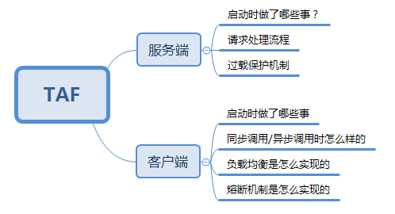
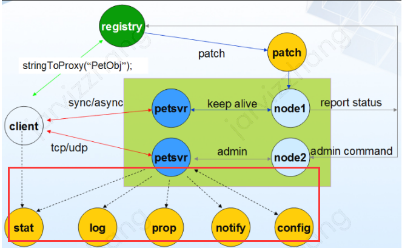

# TAF_JAVA学习二



### Server启动流程

####  程序入口：

```java
package com.qq.tars.server.startup;
import com.qq.tars.server.core.Server;

public class Main {
    public static void main(String[] args) {
        new Server().startUp(args);
    }
}
```

```java
public Server() {
    // 加载配置文件
    loadServerConfig();
}

public void startUp(String args[]) {
    try {
        // Config logger compenent
        configTafLogger();

        //stdout, stderr redirect
        ServerLogger.init();

        // init and start taf om service
        startOmService();

        // Start Container
        startAppContainer();

        // Start NIO Server
        startNIOServer();

        // Start SessionManager
        startSessionManager();

        // Register server hook
        registerServerHook();

        System.out.println("[SERVER] server is ready...");
    } catch (Throwable ex) {
        System.out.println("[SERVER] failed to start server...");
        System.out.close();
        System.err.close();
        System.exit(-1);
    }
}
```
#### 1. 加载服务配置

- 加载过程主要由 ConfigurationManager  （单例--饿汉模式，类加载时就实例化）完成，调用 init() -> loadServerConfig() -> new ServerConfig().load(...)

- ServerConfig 类 ：全局服务配置，记录了服务的基本信息

  ```java
  private String application;  //应用名
  private String serverName; //服务名
  private Endpoint local;
  private String node; 
  private String basePath; //基本路径
  private String config; //配置中心地址
  private String notify; //通知中心地址
  private String log;  //日志中心地址
  private String logPath; //日志文件路径
  private String logLevel; //滚动log日志级别
  private int logRate;
  private String dataPath; 
  private String localIP;
  private int localPort;
  
  private int sessionTimeOut;
  private int sessionCheckInterval;
  private boolean tcpNoDelay;
  private int udpBufferSize;
  
  private String charsetName;
  private LinkedHashMap<String, ServantAdapterConfig> servantAdapterConfMap;
  private CommunicatorConfig communicatorConfig;
  
  public ServerConfig load(Config conf) {
      application = conf.get("/tars/application/server<app>", "UNKNOWN");
      serverName = conf.get("/tars/application/server<server>", null);
      //...
  }
  ```

- Config 类， 读取配置文件内容。（ “<、</、  >、  />、  #、 =”）

#### 2. 初始化日志组件

#### 3. 将标准输出/错误输出重定向到stdout.log/stderr.log文件

```java
public static void init() {
    System.setOut(new PrintStream(new LoggingOutputStream(Logger.getLogger(STDOUT_log_NAME)), true));
    System.setErr(new PrintStream(new LoggingOutputStream(Logger.getLogger(STDERR_LOG_NAME)), true));
}
```
#### 4. 初始化并启动运营服务监控



- OmServiceMngr :: initAndStartOmService

```java
//远程拉取业务服务的配置文件
ConfigHelper.getInstance().setConfigInfo(communicator, app, serverName, basePath);  
//收集业务的心跳上报，服务版本号
NodeHelper.getInstance().setNodeInfo(communicator, app, serverName, container);
//  收集服务状态变更、异常信息以及业务自定义的异常信息等重要信息，然后对这些信息进行监控告警，比如上报连接数据库失败的信息
NotifyHelper.getInstance().setNotifyInfo(communicator, app, serverName);

PropertyReportHelper.getInstance().setPropertyInfo(communicator, modualName);
// reportVersion
NodeHelper.getInstance().reportVersion(ServerVersion.getVersion());
// 创建等待队列属性: 平均值、最大值
Policy avgPolicy = new CommonPropPolicy.Avg();
Policy maxPolicy = new CommonPropPolicy.Max();
PropertyReportHelper.getInstance().createPropertyReporter(OmConstants.PropWaitTime, avgPolicy, maxPolicy);

// JVM heap使用监控
PropertyReportHelper.getInstance().createPropertyReporter(OmConstants.PropHeapUsed, new MemoryHeapUsedAvg());
PropertyReportHelper.getInstance().createPropertyReporter(OmConstants.PropHeapCommitted, new MemoryHeapCommittedAvg());
PropertyReportHelper.getInstance().createPropertyReporter(OmConstants.PropHeapMax, new MemoryHeapMaxAvg());

// JVM线程数量监控
PropertyReportHelper.getInstance().createPropertyReporter(OmConstants.PropThreadCount, new ThreadNumAvg());

// JVM GC监控
for (GarbageCollectorMXBean gcMXBean : ManagementFactory.getGarbageCollectorMXBeans())
{
    PropertyReportHelper.getInstance().createPropertyReporter(OmConstants.PropGcCount + gcMXBean.getName(), new GCNumCount(gcMXBean.getName()));
    PropertyReportHelper.getInstance().createPropertyReporter(OmConstants.PropGcTime + gcMXBean.getName(), new GCTimeSum(gcMXBean.getName()));
}

// 初始化服务stat监控上报 
// 对业务Server之间调用的流量、平均耗时、异常率、超时率进行统计监控
ServerStatHelper.getInstance().init(communicator);
ServerAuthHelper.getInstance().init(communicator);
// 拉起各个Service的任务线程
ScheduledServiceMngr.getInstance().start();
```
#### 5. 初始化容器

经过前面的一系列初始化工作，当前环境已经具备了配置信息、日志记录、运营服务了，此时就应该将业务代码和资源加载进来了，TAF采用了容器Container的概念来实现这一功能，容器初始化所需的配置信息在service.xml 文件读取。 

大致可以分为5个过程：

- new一个类加载器AppClassLoader并设为当前线程上下文类加载器，加载BasePath/ROOT目录下的资源文件
- 读取BasePath/WEB-INF/service.xml文件，解析后加载listener和service，并设置service最大负载max-load，线程池大小threads，队列大小等，生成的ServiceHomeSkeleton放入skeletonMap<serviceName,ServiceHomeSkeleton>中，遍历AppContextListener，触发serviceStarted监听事件
- 加载om管理命令servant （om admin servant）
- 初始化service ，遍历skeletonMap，调用AnalystManager的registry方法，将每个业务service[servant]的方法注册入map中（http_cache / context_cache）
- 启动appContext，遍历appContextListener，触发appContextStarted监听事件

```java
// Server.java
protected void startAppContainer() throws Exception {
    this.mainProtocolFactory = new JceServiceProtocolFactory(new JceCodec(ConfigurationManager.getInstance().getserverConfig().getCharsetName()));
    this.processor = new ServerProcessor();
    this.container = new AppContainer();
    ContainerManager.registerContainer(this.container);

    this.threadPool = new ServerThreadPoolDispatcher();
    this.mainSelectorManager = new SelectorManager(Utils.getSelectorPoolSize(), mainProtocolFactory, threadPool,processor, keepAlive, "server-tcp-reactor", false);
     this.mainSelectorManager.setTcpNoDelay(ConfigurationManager.getInstance().getserverConfig().isTcpNoDelay());

    this.container.start();
}
```

```java
// Container.java 接口  --> AppContainer.java 类
public void start() throws Exception {
    loadApps();  //加载
    defaultApp = contexts.get("");
    System.out.println("[SERVER] The container started successfully.");
}

public void loadApps() throws Exception {
    //从ServerConfig 的BasePath/apps目录下加载配置文件
    String root = ConfigurationManager.getInstance().getserverConfig().getBasePath();
    File dirs = new File(root + "/apps");
    final ClassLoaderManager protocolManager = ClassLoaderManager.getInstance();
    dirs.listFiles(new FileFilter() {
        public boolean accept(File path) {
            String name = path.getName();
            if (name.equals("ROOT")) {
                name = "";
            }
            if (path.isDirectory()) {
                // here 实际调用new AppContextImpl(name, path)
                AppContext context = new AppContext(name, path);
                
                contexts.put(name, context);
                protocolManager.registerClassLoader(name, context.getAppContextClassLoader());
            }
            return false;
        }
    });
}
```

```java
/* AppContextImpl.java  [core code] */
public AppContextImpl(String name, File path) {
    ClassLoader oldClassLoader = null;
    try {
        this.name = name;
        this.path = path;
        oldClassLoader = Thread.currentThread().getContextClassLoader();
        //1.新建一个新的类加载器 AppClassLoader， 设置为当前线程上下文类加载器
        this.classLoader = new AppClassLoader(name, findURLClassPath());
        Thread.currentThread().setContextClassLoader(this.classLoader);
        //2.获取WEB-INF/service.xml并解析，加载解析后的listener和service
        initFromServiceConfigFile();
        //3.注入 om admin servant [tafnode和业务交互使用的管理命令servant比较特殊，不需要带app、service]
        injectOmServices();
        //4.遍历skeletonMap，初始化service
        initServices();
        //5.appContext启动，遍历appContextListener触发监听事件
        appContextStarted(); 
        System.out.println("[SERVER] The application started successfully.  {appname=" + name + "}");
    } catch (Exception ex) {
        ready = false;
        ex.printStackTrace();
        System.out.println("[SERVER] failed to start the applicaton. {appname=" + this.name + "}");
    } finally {
        if (oldClassLoader != null) Thread.currentThread().setContextClassLoader(oldClassLoader);
    }
}

//2.获取WEB-INF/service.xml并解析，加载解析后的listener和service
protected void initFromServiceConfigFile() throws Exception {
    // 1. 使用类加载器加载services.xml配置文件
    URL url = this.classLoader.getResource("WEB-INF/services.xml");
    if (url == null) {
        System.out.println("WARN\tfailed to find WEB-INF/services.xml, " + "tas service will be disabled:contextName=[" + name + "]");
        return;
    }
    //解析service.xml
    XMLConfigFile cfg = new XMLConfigFile();
    cfg.parse(new FileInputStream(new File(url.toURI())));

    XMLConfigElement root = cfg.getRootElement();//获取根节点
    ArrayList<XMLConfigElement> elements = root.getChildList(); //子节点列表
    // 2. load context init params.
    loadInitParams(root.getChildListByName("context-param"));
    // 3. Load context listeners  加载监听器
    loadAppContextListeners(elements);
    // 4. Load services 根据子节点生成ServiceHomeSkeleton，put进skeletonMap<name,skeleton> 中
    loadAppServices(elements);
}

//4.遍历skeletonMap，初始化service
private void initServices() {
    for (String skeletonName : skeletonMap.keySet()) {
        ServiceHomeSkeleton skeleton = skeletonMap.get(skeletonName);
        Class<?> api = skeleton.getApiClass();
        try { //here
            AnalystManager.getInstance().registry(name(), api, skeleton.name());
        } catch (Exception e) {
            System.err.println("app[" + name + "] init jce service[" + api.getName() + "] failed");
            e.printStackTrace();
        }
    }
}

//将service的方法注册到不同协议对应的concurrentHashMap中，以便调用的时候路由
public void registry(String contextName, Class<?> api, String objName) {
    //判断类是否有@HttpService
    if (api.isAnnotationPresent(HttpService.class)) {
        Method[] methods = api.getDeclaredMethods();
        Map<String, Method> nameMethod = new HashMap<String, Method>();
        for (Method m : methods) {
            nameMethod.put(m.getName(), m);
        }
        http_cache.put(objName, nameMethod);
    } else {
        Map<Method, JceMethodInfo> jceMethodsMap = JceHelper.getJceMethodInfo(api, objName);
        if (jceMethodsMap != null && !jceMethodsMap.isEmpty()) {
            Map<String, JceMethodInfo> methodMap = new HashMap<String, JceMethodInfo>();
            for (Entry<Method, JceMethodInfo> entry : jceMethodsMap.entrySet()) {
                methodMap.put(entry.getKey().getName(), entry.getValue());
            }
            context_cache.putIfAbsent(objName, methodMap);
        }
    }
}
```
#### 6. 启动 NIO Server， 初始化网络IO线程模型。 （使用Reactor模式）

```java
   protected void startNIOServer() throws IOException {
       // 1. Start main port server, and it is required.
       startMainServer(host, port);
       // 2. Start admin port and it is required.
       startMainServer(adminHost, adminPort);
       
       // 3. Start extended UDP server, and it is optional.
       startUDPServer();
       // 4. Start extended TCP server, and it is optional.
       startTCPServer();
   }
```

 - 第一个MainServer就是监听处理走JCE协议的客户端请求，JCE下面的传输层是TCP可靠的传输，第二个绑定在adminHost上的MainServer用于处理和Node节点交互的管理命令。

 - 另外两个则用于支持HTTP协议的请求，包括TCP和UDP两种协议，在实现上只需要绑定对应的编解码器Codec就可以了，后文重点关注JCE协议。
 - 还有一个值得注意的地方，目前去理解当前这样的实现，发现多个Obj都会对同一个监听端口复用，也就是说在服务接收到请求的时候是没有办法直接区分开是那个Obj的请求的，只有在后面的业务线程处理时才会分发到各个服务Obj上处理。这里也就是为什么之后看到TAF对于服务连接数的管理，目前是按整个服务的总量来做的。

#### 7. 启动Session管理器

管理器实现类为SessionManagerImpl，它可提供Session的注册和回收，同时还可以绑定监听器来实现一些功能逻辑，目前主要了解其完成的两个工作：

- 管理Session，定期回收过期SessionTimeout连接
- 注册监听器记录连接数，当连接总数大于整个服务的总量限制maxConns关闭该创建的连接

#### 8. Register server hook

当服务退出时候的资源释放，这部分功能可以通过注册JVM 的 Runtime shutdownHook加以实现，主要是关闭seletor管理器和app容器 。

```java
private void registerServerHook() {
    Runtime.getRuntime().addShutdownHook(run() -> {

        try {
            // 1. Stop SelectorManager
            if (mainSelectorManager != null) {
                mainSelectorManager.stop();
            }
            if (udpSelectorManager != null) {
                udpSelectorManager.stop();
            }

            System.out.println("[SERVER] server stopped successfully.");

            // 2. Stop Container
            if (container != null) {
                container.stop();
            }
        } catch (Exception ex) {
            System.err.println("The exception occured at stopping server...");
        }

    });
}
```

