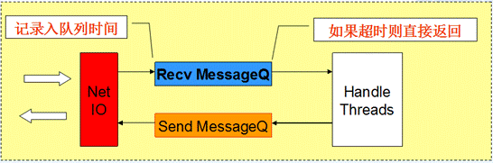
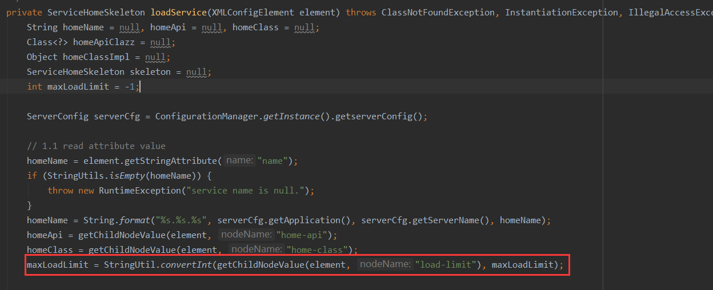
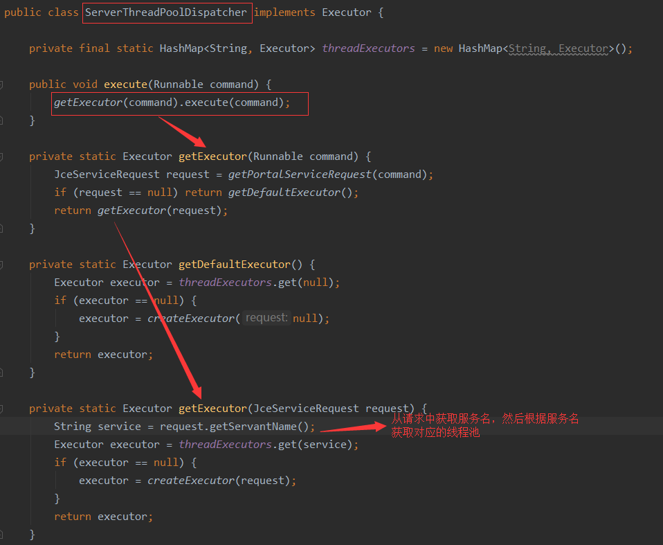
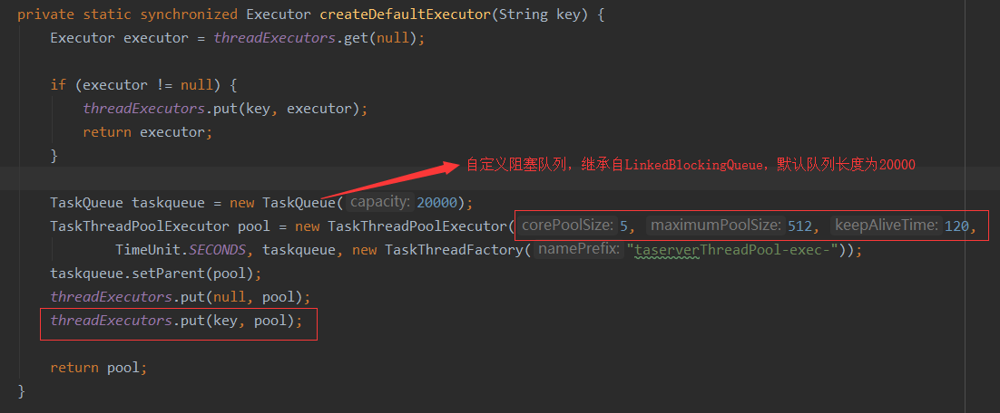
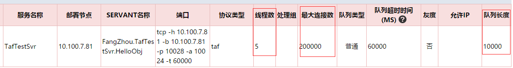
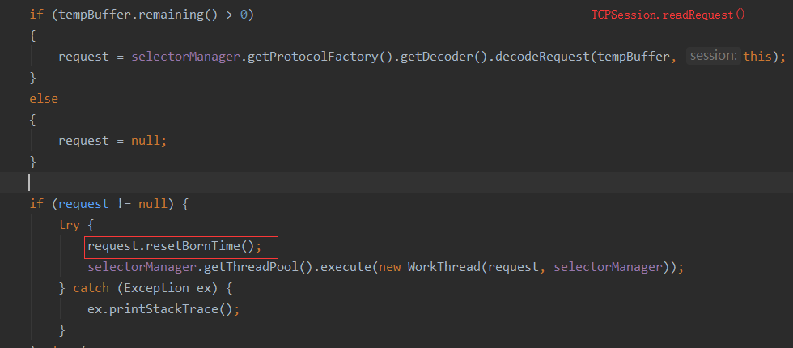
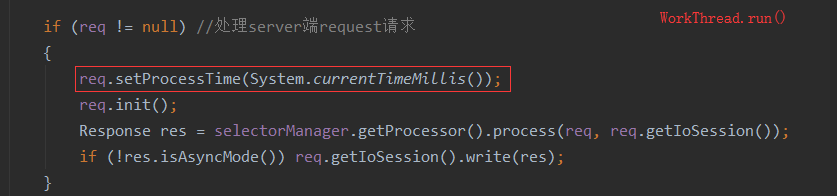

# TAF Java部分源码学习二

## 过载保护

> 过载：简而言之，即当前负载超过了系统/服务的最大处理能力，系统/服务处理不过来，甚至导致服务不可用问题。
>
> TAF框架会对客户端的请求进行过载保护
>
> - 请求的接收队列超过某个阈值，则拒绝新的请求
>
> - 请求在队列里的时间已超过队列设置的超时时间，则执行超时逻辑处理
>
> - 在处理请求时，发现处理时间已超过客户端设置的超时时间，则超时逻辑处理
>
>   

#### 考虑点：

- 服务的最大连接数，线程池缓冲队列
- 服务同一时刻最大负载

- 空间：线程数、队列长度
- 时间：超时策略

### TAF实现策略

1. 限制最大连接数 

   - server接收一个连接的时候回创建对应的session，那么只要在创建session之前判断是否超过最大连接数maxCnt，容易想到使用session监听器 SessionListener

   - SessionManagerImpl启动后会不断遍历session检查是否有超时未处理的sesison，若有则移除（超时时间为60s）

2. 设置服务的最大负载maxLoadLimit  （理解为同一时刻的最大负载）

   - service.xml文件可以设置server的最大负载`<load-limit>`，容器初始化的时候会加载解析xml后进行配置。默认初始值是-1

     

   - 加载服务的时候service映射为ServiceHomeSkeletion，通过反射调用，执行invoke方法的前invokeNumbers+1， 执行完后 invokeNumbers-1

     ```java
     public Object invoke(Method method, Object... args) throws Exception {
         Object value = null;
         Context<? extends Request, ? extends Response> context = null;
         DistributedContext distributedContext = null;
         try {
             context = ContextManager.getContext();
             // 调用前+1
             preInvokeCapHomeSkeleton(context);
     
             distributedContext = DistributedContextManager.getDistributedContext();
             distributedContext.put(DyeingSwitch.REQ, context.request());
             distributedContext.put(DyeingSwitch.RES, context.response());
             
             preInvokeCapHomeSkeleton(distributedContext);
             value = method.invoke(this.service, fixParamValueType(method, args));
         } finally {
             if (!ContextManager.getContext().response().isAsyncMode()) {
                 //上报 //调用后-1
                 postInvokeCapHomeSkeleton(context);
             }
            
             postInvokeCapHomeSkeleton(distributedContext); //保证清理
         }
         return value;
     }
     
     public void preInvokeCapHomeSkeleton(Context<? extends Request, ? extends Response> context) {
         if (this.maxLoadLimit == -1) {
             return;
         }
         this.invokeNumbers.incrementAndGet();  //**
         if (this.invokeNumbers.intValue() > this.maxLoadLimit) {
             throw new RuntimeException(this.name + " is overload. limit=" + this.maxLoadLimit);
         }
     }
     
     public void postInvokeCapHomeSkeleton(Context<? extends Request, ? extends Response> context) {
         if (this.maxLoadLimit == -1) {
             return;
         }
         this.invokeNumbers.decrementAndGet();  //**
     }
     ```

3. 限制最大请求量（队列长度）

   - 一个请求到达被接收，decoder解析Reqeuest后封装成`WorkThread`放入相应service的线程池中执行，所以线程池大小和阻塞队列大小的设定是关键。

   - 值得注意的是，每个service obj都有各自的线程池，请求会通过`ServerThreadPoolDispatcher`分发到各自工作线程池`TaskThreadPoolExecutor`中执行。 

     

   - 每个服务的线程池默认创建配置为：阻塞队列长度为20000，核心线程数量为5，最大线程数量为512，线程空闲后存活时间为120s，默认拒绝策略为直接抛出异常。故队列满之前，线程池只有5个线程处理请求，直到队列饱满才会创建新的线程执行，新创建的线程执行完任务后若120s后仍处于空闲状态，则会被销毁释放。

     

   - 实际上，可以在taf管理平台上服务节点配置线程数、连接数和队列长度等信息，线程池初始化时会读配置信息后创建

     ```java
     /**
        * @param request
        * @return
        */
     private static synchronized Executor createExecutor(JceServiceRequest request) {
             String key = null, contextName = null, serviceName = null;
             Executor executor = null;
             if (request == null) return createDefaultExecutor(null);
     //        contextName = request.getWebappContext();
             serviceName = request.getServantName();
             key = contextName + '_' + serviceName;
             executor = threadExecutors.get(key);
             if (executor != null) return executor;
     
             int minPoolSize = -1, maxPoolSize = -1, queueSize = -1;
             AppContainer container = ContainerManager.getContainer(AppContainer.class);
             AppContextImpl context = container.getDefaultAppContext();
     
             // 客户端请求错误的app或service时，返回默认的executor.
             if (context == null) {
                 return getDefaultExecutor();
             }
             ServiceHomeSkeleton service = context.getCapHomeSkeleton(serviceName);
             if (service == null) {
                 return getDefaultExecutor();
             }
     
            //获取设定的配置
             minPoolSize = service.getMinThreadPoolSize();  //核心线程数
             maxPoolSize = service.getMaxThreadPoolSize();  //最大线程数
             queueSize = service.getQueueSize(); //队列长度
     
             if (minPoolSize < 0 || maxPoolSize < 0 || queueSize < 0) {
                 return createDefaultExecutor(key);
             }
     
             // 创建队列和线程池，并放入map [threadExecutors] 中，以便查找获取
             TaskQueue taskqueue = new TaskQueue(queueSize);
             TaskThreadPoolExecutor pool = new TaskThreadPoolExecutor(minPoolSize, maxPoolSize, 120, TimeUnit.SECONDS, taskqueue, new TaskThreadFactory("taserverThreadPool-exec-" + contextName + '.' + serviceName + '-'));
             taskqueue.setParent(pool);
             threadExecutors.put(key, pool);
     
             return pool;
         }
     ```

   - 由上面分析可知，若当队列饱满且已达到最大线程数，此时再有请求进来则会被直接丢弃掉并抛出异常，这样是不是有点不妥，侧面表现出服务不可用问题呢？另一方面，队列里的任务有些可能已经超时而无效了呢？所以应该在队列满之前采取一些措施。

   > **那么问题来了，有线程池的限制了，为什么还要设置服务的最大负载maxLoadLimit（上面第2点提到的）呢？**
   >
   > 这里主要考虑到服务端异步化，如果对于某个时间较长的IO操作异步化，释放了当前线程，等待该IO操作结束后再callback，那么就有可能存在有空闲线程，但实际上该服务的负载是增加了，也就有可能存在队列未满服务达到最大负载的情况。

   

4. 设置队列超时时间，处理任务前比较等待时间和队列超时时间，若等待时间超过队列超时时间则放弃处理该请求。

   - 请求到达并解析成功后，获取系统时间记为该请求的产生时间 bornTime，封装成WorkThread放入队列，在该请求从队列中取出后，真正发起业务处理前，获取当前系统时间计为该请求的处理时间 processTime，计算两个时间戳的差即为该请求处理时延 waitingTime  = processTime - bornTime。可以在之前就直接设定好一个队列超时时间maxWaitingTimeInQueue ，处理该请求前先判断，若请求处理时延大于队列超时时间（waitingTime  > maxWaitingTimeInQueue ），我们可以判定当前服务过载且该请求失效，直接丢弃该请求。 

     

     

     ```java
     // 2. Directly to give up if exceeds the value of maxWaitingTimeInQueue
     int maxWaitingTimeInQueue = ConfigurationManager.getInstance().getserverConfig().getServantAdapterConfMap().get(request.getServantName()).getQueueTimeout();
     waitingTime = (int) (startTime - req.getBornTime());
     if (waitingTime > maxWaitingTimeInQueue) {
     	throw new InternalException("Wait too long, server busy.");
     }
     ```

   